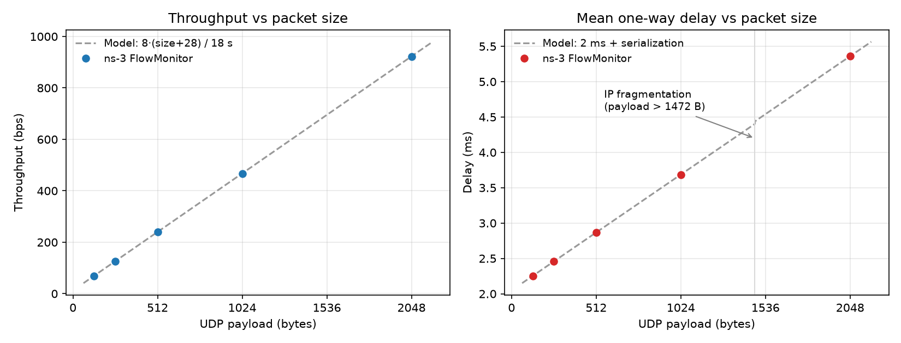

# Network Simulation & Protocol Analysis Lab

Hands-on networking lab covering three parts:

1. **Simulation.** An ns-3 UDP echo simulation. FlowMonitor measures how packet size affects delay and throughput.
2. **Capture.** A Wireshark capture of one real HTTP request/response, dissected layer by layer.
3. **Emulation.** HTTP, SMTP and POP3 exchanges observed in Cisco Packet Tracer.

Completed for **CSE421: Computer Networks** at BRAC University (Lab 2, Fall 2025).



## Repository structure

```
.
├── simulation/
│   ├── udp_echo_flowmon.py      # ns-3 simulation (Python bindings) + FlowMonitor stats
│   └── plot_results.py          # plots a packet-size sweep against the analytical model
├── results/
│   ├── packet_size_sweep.csv    # FlowMonitor output for 128–2048 byte payloads
│   └── packet_size_sweep.png
└── reports/
    ├── ns3-udp-echo-report.pdf           # original lab report (terminal output + graph)
    ├── wireshark-http-analysis.pdf       # annotated Wireshark screenshots
    └── packet-tracer-http-smtp-pop3.pdf  # completed Packet Tracer worksheet
```

---

## Part 1: ns-3 UDP echo simulation

### Topology

```
  n0 (10.1.1.1)  ────────  5 Mbps, 2 ms  ────────  n1 (10.1.1.2)
  UdpEchoClient              point-to-point            UdpEchoServer :9
```

The client (started at t = 2 s) sends one UDP packet to the echo server, which sends it back.
FlowMonitor is installed on both nodes. It reports two flows, client → server and server → client.
The run was repeated with payloads of 128, 256, 512, 1024 and 2048 bytes.

### Running it

The script uses ns-3's Python bindings (tested with **ns-3.40**).

```bash
# inside ns-allinone-3.40/ns-3.40
./ns3 configure --enable-python-bindings
./ns3 build
./ns3 shell
python3 /path/to/simulation/udp_echo_flowmon.py --packet-size 512
```

| Option | Default | Meaning |
|---|---|---|
| `--packet-size` | `2048` | UDP payload in bytes |
| `--packets` | `1` | number of echo requests |
| `--interval` | `1.0` | seconds between requests |
| `--data-rate` | `5Mbps` | link data rate |
| `--delay` | `2ms` | link propagation delay |
| `--csv PATH` | – | append per-flow results to a CSV |

Reproduce the whole sweep and chart:

```bash
for size in 128 256 512 1024 2048; do
  python3 udp_echo_flowmon.py --packet-size $size --csv sweep.csv
done
python3 plot_results.py --csv sweep.csv --out sweep.png   # needs matplotlib
```

### Results

| UDP payload (B) | FlowMonitor bytes | Mean one-way delay | Throughput (18 s window) |
|---:|---:|---:|---:|
| 128  | 156  | 2.2528 ms | 69.33 bps |
| 256  | 284  | 2.4576 ms | 126.22 bps |
| 512  | 540  | 2.8672 ms | 240.00 bps |
| 1024 | 1052 | 3.6864 ms | 467.56 bps |
| 2048 | 2076 | 5.3600 ms | 922.67 bps |

No packets were lost in any run.

### What the numbers show

- **Header overhead is a constant 28 bytes.** FlowMonitor counts at the IP layer, so every packet carries 8 B of UDP header plus 20 B of IPv4 header on top of the payload.
- **Delay = propagation + serialization.** For unfragmented packets, each measured delay equals `2 ms + (IP bytes + 2 B PPP header) × 8 / 5 Mbps` exactly. For 128 B, that is 2 ms + 158 × 8 / 5 000 000 = **2.2528 ms**.
- **The 2048 B packet is fragmented.** 2076 bytes exceeds the 1500-byte point-to-point MTU, so IPv4 sends it as two fragments, and the second fragment adds another 20 B IP header and 2 B PPP header. Without fragmentation the delay would be 5.3248 ms. The measured 5.36 ms matches only when both fragments are counted. FlowMonitor still reports 2076 bytes because it measures datagrams before fragmentation and after reassembly.
- **The throughput line is linear by construction.** One packet is sent, and its bits are averaged over a fixed 18 s window (client start to simulation end). The result is `8 × (payload + 28) / 18`, which measures offered load, not the link's 5 Mbps capacity. To stress the link, send many packets back to back, for example `--packets 1000 --interval 0.001`.

`plot_results.py` draws these analytical models (dashed lines) under the measured points. All five points fall exactly on the lines.

---

## Part 2: Wireshark HTTP capture

The capture is live traffic from a Windows machine, filtered with `http`.
The analysed exchange is an HTTP `GET` to `r3.i.lencr.org`, which serves Let's Encrypt's R3 intermediate certificate.
Operating systems typically fetch this certificate over plain HTTP while validating a TLS chain.

| Layer | Request (frame 2461, 308 B) | Response (frame 2467, 299 B) |
|---|---|---|
| **Link** (Ethernet II) | Intel NIC → Huawei gateway, EtherType IPv4 | Huawei gateway → Intel NIC |
| **Network** (IPv4) | 10.100.223.122 → 23.2.77.119, TTL 128, DF set | 23.2.77.119 → 10.100.223.122, TTL 51, DF set |
| **Transport** (TCP) | 59063 → 80, Seq 1, Ack 1, `PSH, ACK`, 254 B payload | 80 → 59063, Seq 1421, Ack 255, `PSH, ACK`, 245 B payload |
| **Application** (HTTP) | `GET / HTTP/1.1`, `Host: r3.i.lencr.org`, `Connection: keep-alive` | `HTTP/1.1 200 OK`, `Server: nginx`, `Content-Type: application/pkix-cert`, gzip 1253 → 1306 B |

Observations:

- **Ack 255** in the response equals 1 + the request's 254-byte payload. The server has acknowledged the whole request.
- **Seq 1421** in the response means 1420 bytes of it arrived in earlier segments. This frame is the last segment, and Wireshark reassembles all 1665 bytes into one HTTP message.
- **TTL 128 vs 51.** The request carries Windows' default initial TTL. The server's reply arrived with TTL 51, which suggests about 13 hops if it started at 64.
- **The outgoing IP checksum shows `0x0000`** because of checksum offloading. The NIC fills it in after Wireshark has captured the packet.
- **The response is cacheable and compressed:** `Cache-Control: max-age=3600`, `Content-Encoding: gzip`, `Content-Disposition: attachment; filename="R3.der"`.

Annotated screenshots are in [`reports/wireshark-http-analysis.pdf`](reports/wireshark-http-analysis.pdf).

---

## Part 3: Packet Tracer: HTTP, SMTP and POP3

A small Cisco Packet Tracer network was used in simulation mode: two PCs, two switches, a web server and an email server.

| Scenario | Packets observed | Purpose |
|---|---|---|
| Browse `www.bracu.ac.bd` | DNS → ARP → HTTP `GET` → HTTP `200 OK` | Resolve the name and the MAC address, request the page, and receive the HTML |
| Send an email | DNS → SMTP (client → server) → SMTP reply | Find the mail server, then push the message to it. The server acknowledges delivery |
| Receive email | DNS → POP3 (client → server) → POP3 reply | Find the mail server, then pull the waiting messages down to the client |

The completed worksheet is in [`reports/packet-tracer-http-smtp-pop3.pdf`](reports/packet-tracer-http-smtp-pop3.pdf).

---

## Tools

ns-3.40 (Python/cppyy bindings) · Wireshark · Cisco Packet Tracer · Python · matplotlib

The simulation script is adapted from ns-3's [`examples/tutorial/first.py`](https://gitlab.com/nsnam/ns-3-dev/-/blob/master/examples/tutorial/first.py).
